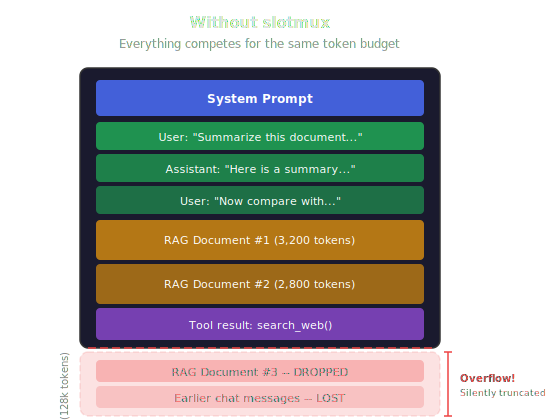
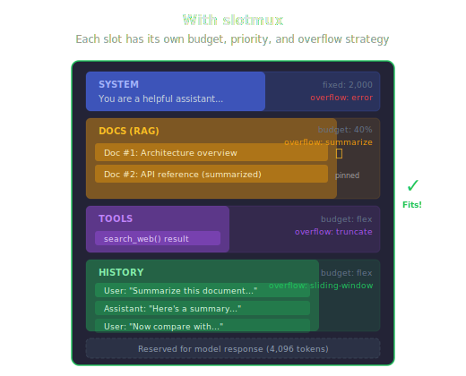
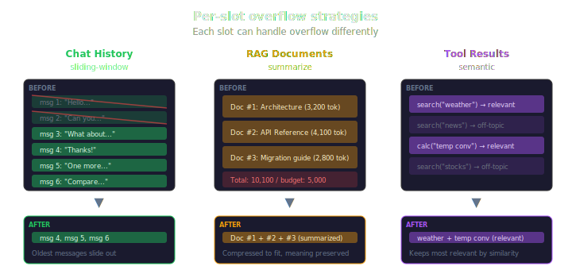

<p align="center">
  
</p>

<p align="center">
  <b>slotmux</b><br/>
  <i>Your LLM app has a token budget. Slotmux manages it.</i>
</p>

<p align="center">
  <a href="https://github.com/tfrydrychewicz/slotmux/actions/workflows/ci.yml"></a>
  <a href="https://www.npmjs.com/package/slotmux"></a>
  <a href="https://bundlephobia.com/package/slotmux"></a>
  <a href="LICENSE"></a>
  <a href="https://tfrydrychewicz.github.io/slotmux/"></a>
</p>

---

## The problem

Every LLM has a context window — a hard limit on how many tokens it can see at once. Your system prompt, chat history, RAG documents, and tool results all share that one budget.

What happens when the conversation grows? You're cutting from the top and hoping it fits. A critical instruction gets silently truncated. A retrieved document vanishes. The model hallucinates because it lost context it needed.

<p align="center">
  
</p>

## The solution: slots with budgets

Slotmux organizes your context into **named slots** — system prompt, history, documents, tools — each with its own token budget and overflow strategy. You declare what you need; slotmux figures out how to make it fit.

Important content? **Pin it** — slotmux will never compress or drop it. Flexible budget? Use **flex** allocation and let slotmux distribute remaining tokens automatically.

<p align="center">
  
</p>

```typescript
import { createContext, Context } from 'slotmux';
import { openai, formatOpenAIMessages } from '@slotmux/providers';

const { config } = createContext({
  model: 'gpt-5.4',
  preset: 'chat',
  reserveForResponse: 4096,
  lazyContentItemTokens: true,
  slotmuxProvider: openai({ apiKey: process.env.OPENAI_API_KEY! }),
});

const ctx = Context.fromParsedConfig(config);
ctx.system('You are a helpful assistant.');
ctx.user('What is slotmux?');

const { snapshot } = await ctx.build();
const messages = formatOpenAIMessages(snapshot.messages);
// Overflow summarization works automatically — no manual wiring needed.
```

## Per-slot overflow: the killer feature

When a slot runs out of space, you decide what happens — **per slot**. Not a one-size-fits-all truncation, but a strategy tailored to each type of content.

Your RAG documents overflow? **Summarize** them progressively — the meaning is preserved. Chat history grows too long? Use a **sliding window** to keep recent messages. Tool results piling up? Keep the most **semantically relevant** ones.

<p align="center">
  
</p>

```typescript
createContext({
  model: 'claude-sonnet-4-20250514',
  reserveForResponse: 8192,
  slots: {
    system:  { priority: 100, budget: { fixed: 2000 },  overflow: 'error' },
    docs:    { priority: 80,  budget: { percent: 40 },  overflow: 'summarize' },
    tools:   { priority: 70,  budget: { flex: true },   overflow: 'semantic' },
    history: { priority: 50,  budget: { flex: true },   overflow: 'sliding-window' },
  },
});
```

Eight strategies built in — `truncate`, `truncate-latest`, `sliding-window`, `summarize`, `semantic`, `compress`, `error`, `fallback-chain` — or bring your own.

## Build once, send anywhere

Slotmux doesn't care which model you're using. Build your context once, then format it for any provider:

```typescript
import { formatOpenAIMessages, formatAnthropicMessages } from '@slotmux/providers';

const { snapshot } = await ctx.build();

const openaiMessages    = formatOpenAIMessages(snapshot.messages);
const anthropicMessages = formatAnthropicMessages(snapshot.messages);
```

Same slot logic, same overflow strategies, same token budgets — whether you're talking to GPT, Claude, Gemini, Mistral, or a local model. Switch providers without rewriting your context management.

## Get started in 30 seconds

```bash
npm install slotmux
```

Three presets to get you going instantly:

```typescript
createContext({ model: 'gpt-5.4', preset: 'chat' });    // system + history
createContext({ model: 'gpt-5.4', preset: 'rag' });     // system + docs + history
createContext({ model: 'gpt-5.4', preset: 'agent' });   // system + tools + scratchpad + history
```

Or define your own slot layout — see the [documentation](https://tfrydrychewicz.github.io/slotmux/concepts/slots).

## Packages

| Package | Size (gzip) | What it does |
| --- | --- | --- |
| `slotmux` | 7 kB | Core — slots, budgets, build pipeline, snapshots |
| `@slotmux/providers` | 3 kB | OpenAI, Anthropic, Google message formatters |
| `@slotmux/react` | 2 kB | `ReactiveContext` + hooks for React apps |
| `@slotmux/compression` | — | Progressive, semantic, and lossless compression |
| `@slotmux/tokenizers` | — | Token counting adapters (gpt-tokenizer, tiktoken) |
| `@slotmux/plugin-rag` | — | RAG slot defaults, deduplication, citations |
| `@slotmux/plugin-tools` | — | Tool results management with auto-truncation |
| `@slotmux/plugin-memory` | — | Persistent memory stores |
| `@slotmux/plugin-otel` | — | OpenTelemetry traces and metrics |
| `@slotmux/debug` | — | Browser-based inspector UI for timelines and diffs |

## How it compares

| | slotmux | LangChain memory | tiktoken alone | Manual |
| --- | :---: | :---: | :---: | :---: |
| Slot-based allocation | **Yes** | — | — | — |
| Declarative budgets | **Yes** | — | — | — |
| Overflow strategies | **8 + custom** | 3 | — | DIY |
| Provider agnostic | **Yes** | Partial | OpenAI only | DIY |
| Cached token counting | **Yes** | Via wrappers | Yes | DIY |
| Plugin system | **Yes** | — | — | — |
| Immutable snapshots | **Yes** | — | — | — |
| Snapshot diffing | **Yes** | — | — | — |
| Serialization + checksums | **Yes** | — | — | DIY |
| Debug inspector | **Yes** | — | — | — |
| React bindings | **Yes** | — | — | — |
| TypeScript-first | **Strong** | Partial | Strong | Varies |
| Standalone (no framework) | **Yes** | Needs LangChain | Yes | Yes |
| Core bundle | **7 kB** | Large stack | ~5 kB | 0 |

## Documentation

| | |
| --- | --- |
| **Full docs** | [tfrydrychewicz.github.io/slotmux](https://tfrydrychewicz.github.io/slotmux/) |
| **Tutorial** | [Build a terminal chatbot](https://tfrydrychewicz.github.io/slotmux/guide/build-a-chatbot) — working chat app in 5 minutes |
| **Concepts** | [Slots](https://tfrydrychewicz.github.io/slotmux/concepts/slots) · [Budgets](https://tfrydrychewicz.github.io/slotmux/concepts/budgets) · [Overflow](https://tfrydrychewicz.github.io/slotmux/concepts/overflow) · [Compression](https://tfrydrychewicz.github.io/slotmux/concepts/compression) · [Snapshots](https://tfrydrychewicz.github.io/slotmux/concepts/snapshots) |
| **Frameworks** | [React](https://tfrydrychewicz.github.io/slotmux/guides/react) · [Vue](https://tfrydrychewicz.github.io/slotmux/guides/vue) · [Angular](https://tfrydrychewicz.github.io/slotmux/guides/angular) |
| **API reference** | [Generated TypeDoc](https://tfrydrychewicz.github.io/slotmux/reference/api/README) |

## Contributing

Issues and PRs are welcome. See [CONTRIBUTING.md](CONTRIBUTING.md) for setup, testing (`pnpm test:coverage`), changesets, and review expectations.

## License

[MIT](LICENSE)
